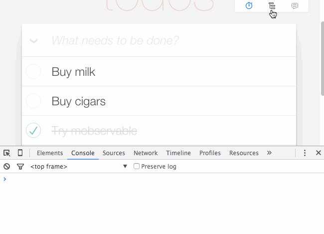

# mobx-react-devtools



## Installation

`npm install mobx-react-devtools --save-dev`

## Usage

Somewhere in your application, create a DevTools component:

```jsx
import DevTools from 'mobx-react-devtools';

class MyApp extends React.Component {
  render() {
    return (
      <div>
        ...
        <DevTools />;
      </div>
    );
  }
}
```

Supported props:
* `hightlightTimeout` — number, default: 1500.
* `position` — object, position of control panel, default: {top: 0, right: '20px'}.


From there on, after each rendering a reactive components logs the following three metrics:
1. Number of times the component did render so far.
2. The time spend in the `render()` method of a component
3. The time spend from the start of the `render()` method until the changes are flushed to the DOM.

For each component the color indicates roughly how long the coloring took. Rendering times are cummalitive; they include time spend in the children.
* Green: less then 25 ms.
* Orange: less then 100 ms.
* Red: rendering for this component took more than 100ms.

## Roadmap

* ~~Be able to turn dev-tools on and off at runtime.~~
* ~~Select and log dependency tree of components.~~
* Visualize observer tree values
* ~~Be able to enable state change tracking from the extras module~~
